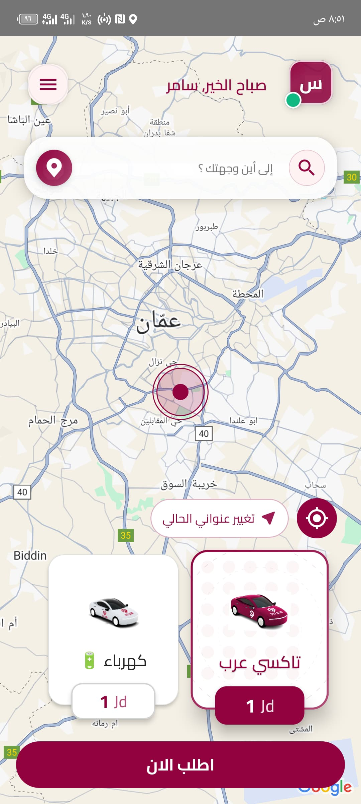
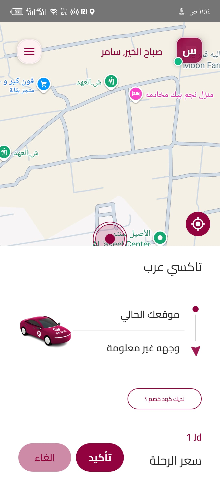
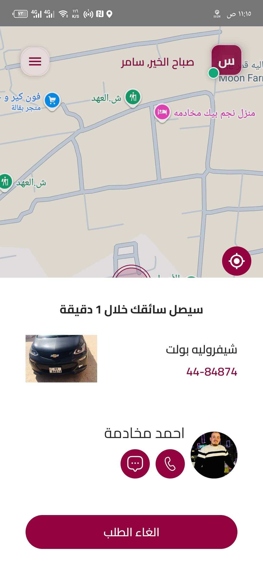
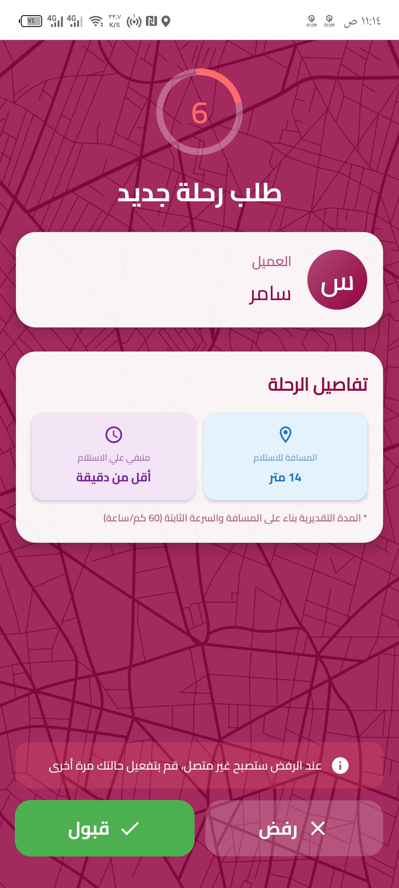
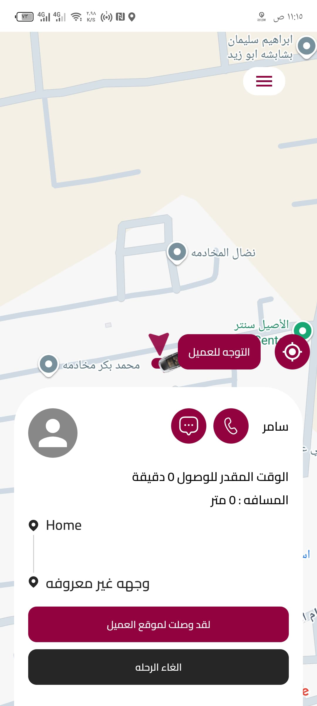
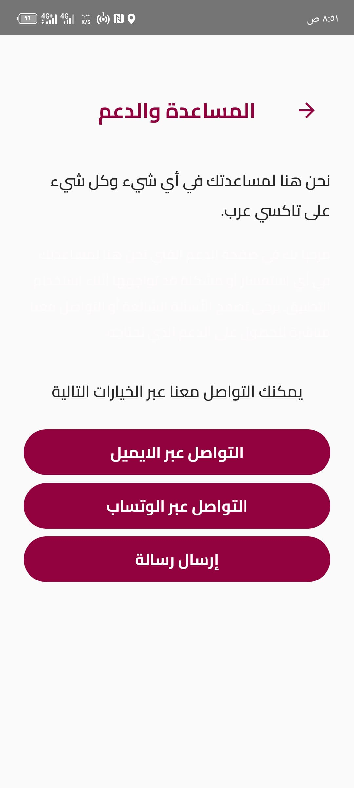

# 🚕 Taxi Arab – Laravel Backend Contributions

> 💼 This is a **work showcase repo** for my contributions as a backend developer on a real ride-hailing app built with Laravel.

---

## 🧠 About the App

**Taxi Arab** is a live ride-hailing app similar to Uber, operating in Jordan 🇯🇴 with real users, real drivers, and real-time orders.

It has separate mobile apps for **customers** and **drivers**, and the backend is a Laravel system I worked on extensively to **improve its core logic, scalability, and reliability**.

---

## 🧑‍💻 My Role

- **Position**: Backend Developer (Laravel)
- **Period**: Jan 2025 – Present
- **Team**:
  - Myself (Laravel backend)
  - Ali (iOS developer)
  - Kareem (Android developer)

---

## 🚀 What I Did

### ✅ Rebuilt the Ride Invitation Logic

- Switched from 1-by-1 to **3-by-3 batch invitations**
- Made retry count dynamic using a DB `MAX_RETRY_COUNT` setting
- Auto-expired pending invites once ride was accepted or maxed out

### ✅ Queues & Job Optimization

- Used **Redis** queue with Laravel Horizon
- Prevented duplicate jobs, added immediate cancel logic
- Refactored `SearchForDriverJob` & improved job scheduling

### ✅ Driver Presence & Status

- Implemented **online/offline system** for drivers
- Integrated token-based presence tracking
- Dynamically filtered offline drivers from ride invitations

### ✅ Admin Dashboard Features

- Real-time stats & metrics for active rides/drivers
- Exported driver phone numbers to Excel
- Added ride filters based on `acceptance_status`

### ✅ Safe Production Deployment

- Performed live debugging with `info()` logs
- Deployed at **midnight only** to avoid disrupting real users
- Rolled out ride cycle refactors without any downtime

---

## 📸 Screenshots

  
  
  

  
  
  

---

## 📊 Real-Time System

- Built with **Pusher** for instant socket communication
- Drivers and customers receive status updates in real time
- Laravel backend manages socket channel joins, events & logging

---

## ✅ Results

- 🚗 Ride cycle now works with full stability under load
- 📉 Reduced failure rate of unassigned rides
- 🚀 Queues cleared cleanly & workers optimized
- 📊 Dashboard is more insightful & useful to ops team

---

## 🏗 Tech Stack

| Layer     | Tech                              |
|----------|------------------------------------|
| Backend  | Laravel (PHP 8.x), MySQL           |
| Queues   | Redis, Laravel Horizon             |
| Real-time| Pusher                             |
| Auth     | Laravel Sanctum                    |
| Logs     | Laravel Logs, `info()`, Horizon    |
| Mobile   | iOS (Swift), Android (Kotlin)      |

---

## 📂 Docs

- [`docs/ride-cycle.md`](./docs/ride-cycle.md): Ride invitation flow breakdown (drivers, logic, batching)

---

## 📦 Repo Purpose

This repo is a **showcase only**.  
I was responsible for improving core backend logic on a real app for a real client while employed at **Dinamo Egypt**.  
No source code is shared due to ownership policies.

---

## 💬 Let’s Talk

Want to dive into how I implemented 3-by-3 invitation logic? Or how we scaled the ride cycle using Redis queues?  
Feel free to DM or ask me in interviews — happy to share insights 🙌
